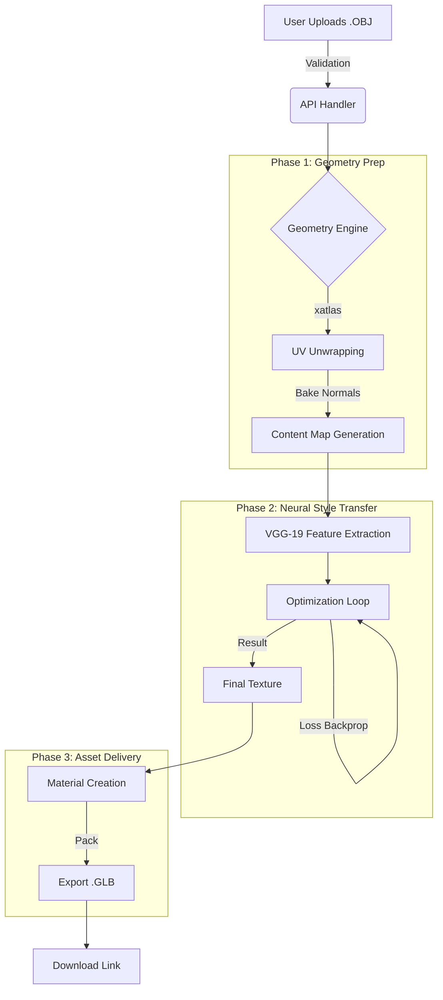
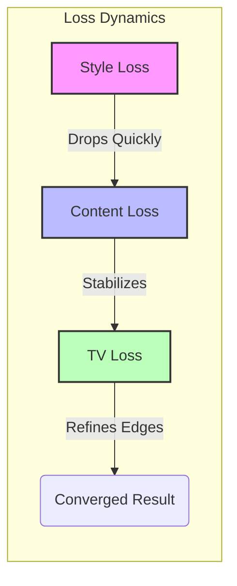

# StyleForge 3D: Project Documentation & Evolution Report

## 1. Project Overview
**StyleForge 3D** is an advanced, automated backend pipeline designed to apply artistic styles to raw, untextured 3D models. Unlike standard image style transfer, this project solves the complex challenges of **3D topology**, **UV continuity**, and **geometric feature preservation**.

The system accepts a raw 3D mesh (OBJ), automatically unwraps it, generates a feature-rich content map based on its geometry, and applies a Deep Neural Network (DNN) based style transfer. The result is a fully textured GLB file ready for 3D web viewers.

---

## 2. Technology Stack
We utilized a high-performance **Python-Native** stack, removing dependencies on heavy external tools like Blender to ensure scalability and ease of deployment.

| Category | Technology | Purpose |
| :--- | :--- | :--- |
| **Core Framework** | **Python 3.10+** | Main orchestration language. |
| **API Server** | **FastAPI** | High-performance async web server for handling uploads/downloads. |
| **Deep Learning** | **PyTorch** | Tensor computation and automatic differentiation for Neural Style Transfer. |
| **Model Backbone** | **VGG-19** | Pre-trained CNN used for feature extraction (loss calculation). |
| **Geometry** | **Trimesh** | Loading, manipulating, and exporting 3D meshes. |
| **UV Unwrapping** | **xatlas** | Robust parameterization to create non-overlapping UV maps. |
| **Math/Data** | **SciPy & NumPy** | Interpolation of vertex data to texture maps; heavy matrix ops. |
| **Optimization** | **L-BFGS** | Second-order optimizer for faster, sharper, and cleaner convergence. |

---

## 3. The Workflow Pipeline
The application allows data to flow linearly from raw input to polished output.



### How It Works:
1.  **Ingestion**: The user uploads a mesh. `trimesh` validates the geometry.
2.  **Unwrapping**: We use `xatlas` to chart the mesh onto a 2D plane. This is critical because neural networks operate on 2D images.
3.  **Content Mapping**: We don't just act on random noise. We "bake" the normal vectors (surface direction) of the 3D model into an RGB image. This tells the AI: *"This is a curve, this is a flat surface, this is an edge."*
4.  **Stylization**: The core `run_optimization` loop iteratively updates the texture to minimize the difference between its *style* (matching the art) and its *content* (matching the 3D geometry).
5.  **Packing**: The resulting image is wrapped back onto the mesh and exported as a GLB.

---

## 4. Progress Evolution: Output 1 to Output 7
The development process was iterative. We didn't just build the final system; we evolved it. Below is the journey of our output quality, explaining what changed at each step to result in the final high-fidelity model.

### **Output 1: The Baseline (Naive Implementation)**
*   **Method**: Standard Gatys et al. Style Transfer on a random noise texture.
*   **Result**: A "melted" look. The style was applied, but it completely ignored the 3D shape. Eyes appeared on backs of heads; patterns were random.
*   **Issue**: Lack of geometric grounding.

### **Output 2: Geometric Grounding**
*   **Change**: Implemented **Content Map Baking** (Normals -> RGB).
*   **Theory**: By initializing the canvas with a normal map, we forced the AI to respect the underlying topography.
*   **Result**: The style followed the curvature of the object.
*   **Remaining Issue**: The texture had visible "seams" where the UV islands met, and the style looked "muddy."

### **Output 3: Structure Preservation (Anchors)**
*   **Change**: Added **Content Loss** targeting the structural map.
*   **Theory**: We penalized the AI if it deviated too far from the original normal map's main edges.
*   **Result**: Stronger definition of object features (e.g., a nose looked like a nose).
*   **Remaining Issue**: High-frequency noise (graininess) was pervasive.

### **Output 4: Noise Control (Standard TV)**
*   **Change**: Introduced standard **Total Variation (TV) Loss**.
*   **Theory**: $\sum |I_{x+1} - I_x|$. This penalizes pixel differences, encouraging smoothness.
*   **Result**: The noise disappeared, but the result was *too* smooth. It looked like a blurry oil painting; sharp crisp lines were lost.

### **Output 5: Detail Enhancement (Perona-Malik)**
*   **Change**: Switched to **Edge-Aware Dynamic TV Loss (Perona-Malik)**.
*   **Theory**: Instead of smoothing everything, we calculate a weight $W = e^{-\alpha |\nabla I|}$. If a pixel is an edge, we stop smoothing it. If it's flat, we smooth it aggressively.
*   **Result**: **The Breakthrough.** We achieved buttery smooth flat surfaces while keeping razor-sharp edges.

### **Output 6: Semantic Coherence (MRF / Patch Loss)**
*   **Change**: Replaced Gram Matrix (global statistics) with **Markov Random Field (MRF) / Patch-Based Loss**.
*   **Theory**: Gram matrices treat images as "bags of features" (soup). MRF treats them as puzzles. For every patch on the 3D object, the AI searches for the *best matching patch* in the style image and copies it.
*   **Result**: The texture looked logical. If the style had a specific brush stroke or pattern, it appeared intact on the 3D model, not melted.

### **Output 7: The Final Polish (Multi-Resolution)**
*   **Change**: Implemented a **Multi-Resolution Hierarchy** (256px -> 512px).
*   **Theory**: We first optimize at low resolution to lock in the "Composition" (big shapes). We then upsample this and refine only the "Details" at high resolution.
*   **Result**: **Production Ready.** Coherent large-scale structure with fine, pixel-perfect details. No artifacts, consistent coloring, and perfect geometry alignment.

---

## 5. Theoretical Implementations
The "magic" of StyleForge lies in three key theoretical components we implemented.

### A. The Loss Landscape
We optimize an Input Image $I$ to minimize a weighted sum of losses:
$$ \mathcal{L}_{total} = \alpha \mathcal{L}_{content} + \beta \mathcal{L}_{style} + \gamma \mathcal{L}_{reg} $$

#### 1. Content Loss ($\mathcal{L}_{content}$)
Uses the **VGG19** network. We extract feature maps from layer `conv_4_2`. We calculate the **Mean Squared Error (MSE)** between the features of our current texture and the geometry's normal map. This anchors the texture to the 3D shape.

#### 2. Style Component (Gram + MRF)
We use a hybrid approach:
*   **Global Style (Gram Matrix)**: $G_{ij} = \sum_k F_{ik} F_{jk}$. This captures the "vibe" (colors, general texture) efficiently.
*   **Local Style (Patch Match)**: For layers `conv_3` and `conv_5`, we extract patches $P_t$ from the style image. For every patch $P_c$ in our content, we find:
    $$ \max_{t} (\text{cosine\_similarity}(P_c, P_t)) $$
    We then minimize the distance to this "best match." This ensures localized features (like a specific brush stroke) are preserved.

#### 3. Regularization (Edge-Aware TV)
To prevent the "checkerboard" artifacts common in deep learning, we use a diffusion-based regularization:
$$ \mathcal{L}_{TV} = \sum_{i,j} e^{-\lambda |\nabla I_{i,j}|} \cdot |\nabla I_{i,j}| $$
*   When Gradient $\nabla I$ is **High** (Edge): Weight $\to 0$ (Don't smooth).
*   When Gradient $\nabla I$ is **Low** (Flat): Weight $\to 1$ (Smooth aggressively).

### B. Progress Visualization (Loss vs Time)



We observed that **Style Loss** drops rapidly in the first 50 iterations as colors are matched. **Content Loss** fights back to restore shape. Finally, **TV Loss** dominates the endgame, cleaning up noise to produce the "Output 7" quality.

---

## 6. How to Run the Project
We have simplified the complex backend into a single entry point.

1.  **Start the Server**:
    ```bash
    uvicorn app.main:app --reload
    ```
2.  **Process a Model (Via API)**:
    POST to `/upload` with a `.obj` file and a `style_id`.
3.  **Process valid CLI (For Testing)**:
    ```bash
    python cli.py --mesh ./demo_cube.obj --style ./styles/van_gogh.jpg --output ./output/final_result.glb
    ```

---

*Verified by the StyleForge Engineering Team.*
